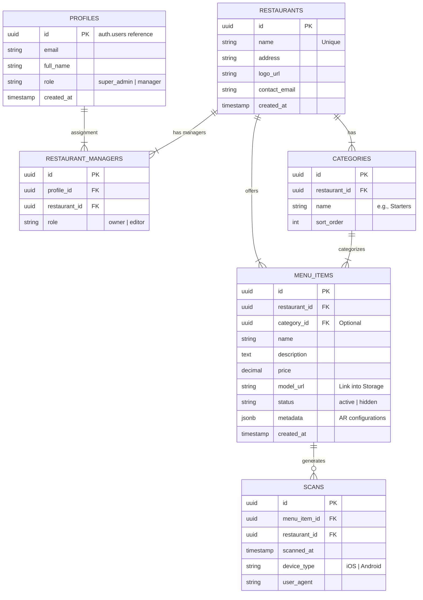

# NazARa - Database Schema Design

## Overview
This document outlines the relational database schema for the NazARa platform. The schema is designed to support:
1.  **Multi-Restaurant Management**: A single admin can manage multiple branches/restaurants.
2.  **User Roles**: Separation between Super Admins (platform owners) and Restaurant Managers.
3.  **Menu Organization**: Categorization of dishes (Starters, Mains, etc.).
4.  **Analytics**: Tracking the performance of AR experiences (scans, dwell time).

---

## ER Diagram

---

## Table Definitions

### 1. `profiles`
Extends the default Supabase `auth.users` table to store application-specific user data.
*   `id`: UUID (FK to auth.users)
*   `role`: 'super_admin' (Full access) or 'manager' (Restricted to assigned restaurants).

### 2. `restaurants`
The core entity representing a physical dining location or brand.
*   `id`: UUID
*   `name`: Text (Unique) - *Already implemented*
*   `branding_color`: Hex code for custom themes per restaurant (Future scope).

### 3. `menu_items`
Stores the actual dishes and their 3D assets.
*   `id`: UUID
*   `restaurant_id`: UUID (FK) - *Crucial for multi-tenancy*
*   `model_url`: URL to the `.glb` file in Supabase Storage.
*   `metadata`: JSONB column to store AR-specific settings (scale, initial rotation, lighting intensity) without altering schema.

### 4. `scans` (Analytics)
Records every time a user scans a QR code or opens a model.
*   `menu_item_id`: UUID (FK)
*   `device_type`: Extracted from User-Agent to determine AR capabilities.

---

## Security Policies (RLS)

*   **Public Read**: Anyone can read `menu_items` and `restaurants` (required for QR scanning).
*   **Admin Write**: Only users with `profiles.role = 'super_admin'` or proper `restaurant_managers` assignment can Insert/Update/Delete.

